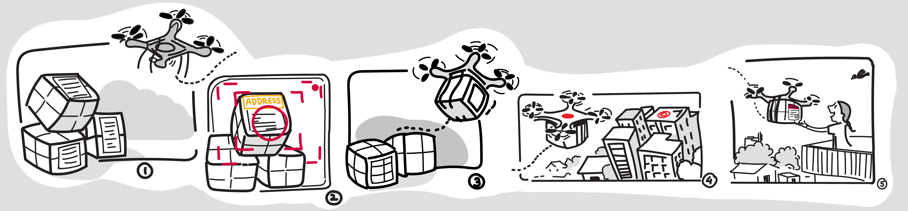

# E-YRC
## Team VD#1632 Members
1. [Dhairya Shah](https://github.com/dhairyashah1) 
1. [Ninad Jangle](https://github.com/ninja3011)
1. [Karthik Swaminathan](https://github.com/kart1802)
1. [Dhruvi Doshi](https://github.com/dhruvi29)

## Theme: Vitarana Drone

### About
In urban streets, especially South Asian streets, clogged with automobiles, people, animals, markets and numerous other things(!) using typical modes of transport for delivery, such as cars and bikes, is slow and wasteful. Fortunately, enabled by progress in embedded systems, materials science and control systems, unmanned aerial vehicles (UAVs), have become widespread in the past couple of decades and provide a simpler and faster alternative to using terrestrial infrastructure!

These UAVs are a result of improvements in semiconductor and microprocessor technology, enabling faster chips and smaller, more efficient, power electronics. Improvements in materials sciences & manufacturing have led to the creation of novel, cheap, precise & robust sensors, along with huge improvements in battery technology. 

Vitarana Drone. Vitarana (IPA: vitaraṇa) means distribution in Sanskrit and many extant languages of South Asia.

### Tech stack
1. Robot Operating System
1. robotics simulator Gazebo
1.the Python programming language and many of its libraries.

### Concepts used
1. concepts of control systems
1. path planning
1. image processing
1. algorithm development

### The final problem Statement
The competition was conducted as a series of 6 tasks,final problem statement is for the drone to deliver various packages to their destinations, optimizing for time and quantity.

